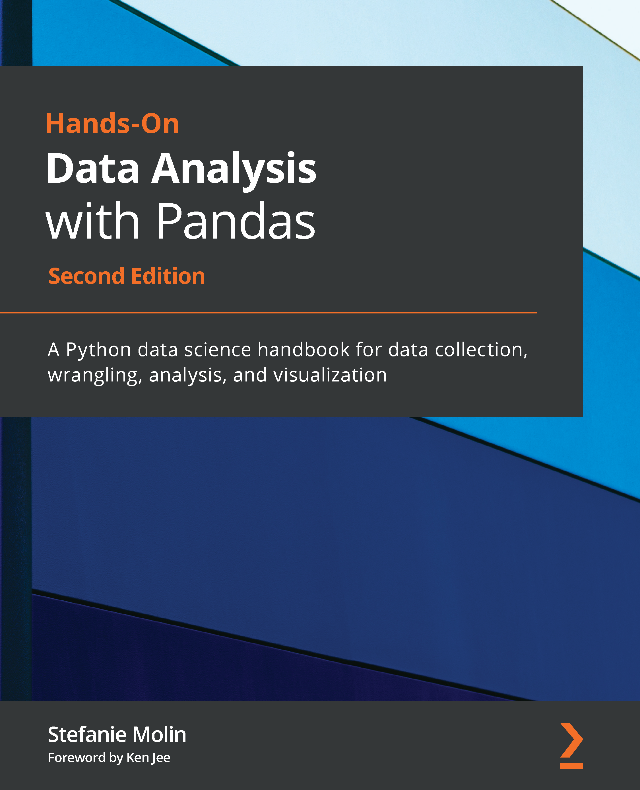

# Hands-On Data Analysis with Pandas &ndash; Second Edition
   

This is the code repository for my book [Hands-On Data Analysis with Pandas](https://www.amazon.com/Hands-Data-Analysis-Pandas-visualization/dp/1800563450), published by Packt on July 26, 2019 ([1st edition](https://www.amazon.com/Hands-Data-Analysis-Pandas-visualization/dp/1789615321)) and April 29, 2021 ([2nd edition](https://www.amazon.com/Hands-Data-Analysis-Pandas-visualization/dp/1800563450)).

## Versions
This repository contains git tags for the materials as they were at time of publishing. Available tags:

- [1st_edition](../../tree/1st_edition)
- [2nd_edition](../../tree/2nd_edition)

## Book Description
Data analysis has become an essential skill in a variety of domains where knowing how to work with data and extract insights can generate significant value. *Hands-On Data Analysis with Pandas* will show you how to analyze your data, get started with machine learning, and work effectively with the Python libraries often used for data science, such as pandas, NumPy, matplotlib, seaborn, and scikit-learn.

Using real-world datasets, you will learn how to use the pandas library to perform data wrangling to reshape, clean, and aggregate your data. Then, you will learn how to conduct exploratory data analysis by calculating summary statistics and visualizing the data to find patterns. In the concluding chapters, you will explore some applications of anomaly detection, regression, clustering, and classification using scikit-learn to make predictions based on past data.

This updated edition will equip you with the skills you need to use pandas 1.x to efficiently perform various data manipulation tasks, reliably reproduce analyses, and visualize your data for effective decision making—valuable knowledge that can be applied across multiple domains.

## What You Will Learn
*Prerequisite: If you don't have basic knowledge of Python or past experience with another language (R, SAS, MATLAB, etc.), consult the [`ch_01/python_101.ipynb`](./ch_01/python_101.ipynb) Jupyter notebook for a Python crash-course/refresher.*
- Understand how data analysts and scientists gather and analyze data
- Perform data analysis and data wrangling in Python
- Combine, group, and aggregate data from multiple sources
- Create data visualizations with `pandas`, `matplotlib`, and `seaborn`
- Apply machine learning algorithms with `sklearn` to identify patterns and make predictions
- Use Python data science libraries to analyze real-world datasets.
- Use `pandas` to solve several common data representation and analysis problems
- Collect data from APIs
- Build Python scripts, modules, and packages for reusable analysis code.
- Utilize computer science concepts and algorithms to write more efficient code for data analysis
- Write and run simulations

## Table of Contents
- [Chapter 1, *Introduction to Data Analysis*](./ch_01), will teach you the fundamentals of data analysis, give you a foundation in statistics, and get your environment set up for working with data in Python and using Jupyter Notebooks.

- [Chapter 2, *Working with Pandas DataFrames*](./ch_02), introduces you to the `pandas` library and shows you the basics of working with `DataFrames`.

- [Chapter 3, *Data Wrangling with Pandas*](./ch_03), discusses the process of data manipulation, shows you how to explore an API to gather data, and guides you through data cleaning and reshaping with pandas.

- [Chapter 4, *Aggregating Pandas DataFrames*](./ch_04), teaches you how to query and merge DataFrames, perform complex operations on them, including rolling calculations and aggregations, and how to work effectively with time series data.

- [Chapter 5, *Visualizing Data with Pandas and Matplotlib*](./ch_05), shows you how to create your own data visualizations in Python, first using the `matplotlib` library, and then directly from `pandas` objects.

- [Chapter 6, *Plotting with Seaborn and Customization Techniques*](./ch_06), continues the discussion on data visualization by teaching you how to use the `seaborn` library for visualizing your long form data and giving you the tools you need to customize your visualizations, making them presentation-ready.

- [Chapter 7, *Financial Analysis: Bitcoin and the Stock Market*](./ch_07), walks you through the creation of a [Python package for analyzing stocks](https://github.com/stefmolin/stock-analysis), building upon everything learned in chapters 1-6 and applying it to a financial application.

- [Chapter 8, *Rule-Based Anomaly Detection*](./ch_08), covers [simulating data](https://github.com/stefmolin/login-attempt-simulator) and applying everything learned in chapters 1-6 to catching hackers attempting to authenticate to a website, using rule-based strategies for anomaly detection.

- [Chapter 9, *Getting Started with Machine Learning in Python*](./ch_09), introduces you to machine learning and building models using the `sklearn` library.

- [Chapter 10, *Making Better Predictions: Optimizing Models*](./ch_10), shows you strategies for improving the performance of your machine learning models.

- [Chapter 11, *Machine Learning Anomaly Detection*](./ch_11), revisits anomaly detection on login attempt data, using machine learning techniques, all while giving you a taste of how the workflow looks in practice.

- [Chapter 12, *The Road Ahead*](./ch_12), contains resources for taking your skills to the next level and further avenues for exploration.

## What's New in This Edition?
All the code examples have been updated for newer versions of the libraries used (see the [requirements.txt](./requirements.txt) file for the full list). The second edition also features new/revised examples highlighting new features. For `pandas` in particular, the first edition uses a much older version than what is currently available (pre 1.0), and this edition brings the content up to date with the latest version (1.x). You can look through the `pandas` [release notes](https://pandas.pydata.org/docs/whatsnew/index.html) to get an idea of all the changes that have happened since the version of `pandas` used in the first edition (0.23.4). In addition, there are significant changes to the content of some chapters, while others have new and improved examples and/or datasets.

## Notes on Environment Setup
Environment setup instructions are in the chapter 1 of the text. If you don't have the book, you will need to install Python 3.7 (3.7.1 or higher) or Python 3.8, [set up a virtual environment](https://packaging.python.org/guides/installing-using-pip-and-virtual-environments/#creating-a-virtual-environment) (if you have Python 3.9+ installed, you should create a virtual environment with `conda` and specify Python 3.8 as discussed in [this issue](https://github.com/stefmolin/Hands-On-Data-Analysis-with-Pandas-2nd-edition/issues/2)), [activate it](https://packaging.python.org/guides/installing-using-pip-and-virtual-environments/#activating-a-virtual-environment), and then [install the packages listed in requirements.txt](https://packaging.python.org/guides/installing-using-pip-and-virtual-environments/#using-requirements-files) (note that `git` will need to be installed). You can then launch JupyterLab and use the `ch_01/checking_your_setup.ipynb` Jupyter notebook to check your setup. Consult [this resource](https://anbasile.github.io/programming/2017/06/25/jupyter-venv/) if you have issues with using your virtual environment in Jupyter.

Alternatively, consider using this repository on [Binder](https://mybinder.org/v2/gh/stefmolin/Hands-On-Data-Analysis-with-Pandas-2nd-edition/master) or [Google Colab](https://colab.research.google.com/github/stefmolin/Hands-On-Data-Analysis-with-Pandas-2nd-edition/blob/master).

## Solutions
Each chapter comes with exercises. The solutions for chapters 1-11 can be found [here](./solutions). Since the exercises in chapter 12 are open-ended, no solutions are provided.

## About the Author
Stefanie Molin ([@stefmolin](https://github.com/stefmolin)) is a data scientist and software engineer at Bloomberg L.P. in NYC (and hacker in training) tackling tough problems in Information Security particularly revolving around anomaly detection, building tools for gathering data, and knowledge sharing. She has extensive experience in data science, designing anomaly detection solutions, and utilizing machine learning in both R and Python in the AdTech and FinTech industries. She holds a B.S. in Operations Research from Columbia University’s Fu Foundation School of Engineering and Applied Science with minors in Economics and Entrepreneurship and Innovation.

In her free time, she enjoys traveling the world, inventing new recipes, and learning new languages spoken both among people and computers.

## Acknowledgements
Since the book limited the acknowledgements to 450 characters, the full version is [here](./acknowledgements.md).
