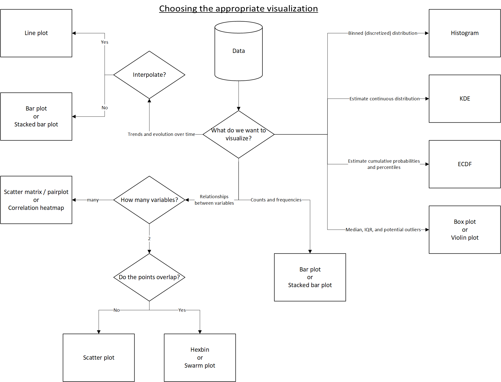
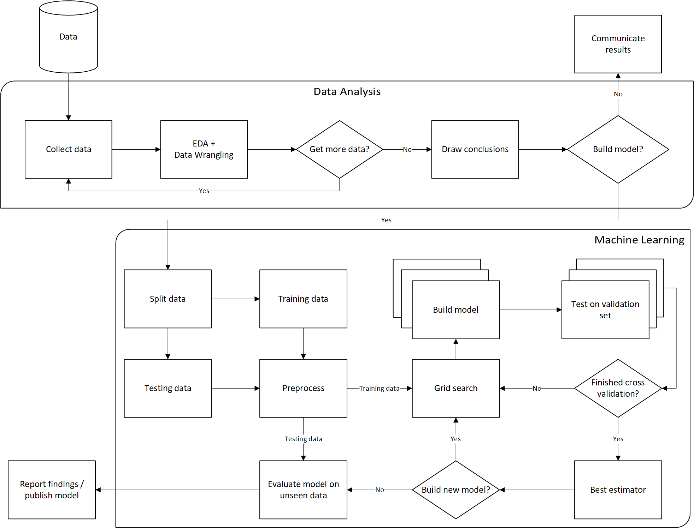

# Appendix
Here are some workflow diagrams for reference.

## Data Analysis Workflow

## Choosing the Appropriate Plot

## Machine Learning Workflow

    

        <a href="../ch_12/README.md">
            <button>&#8592; Chapter 12</button>
        </a>
    

